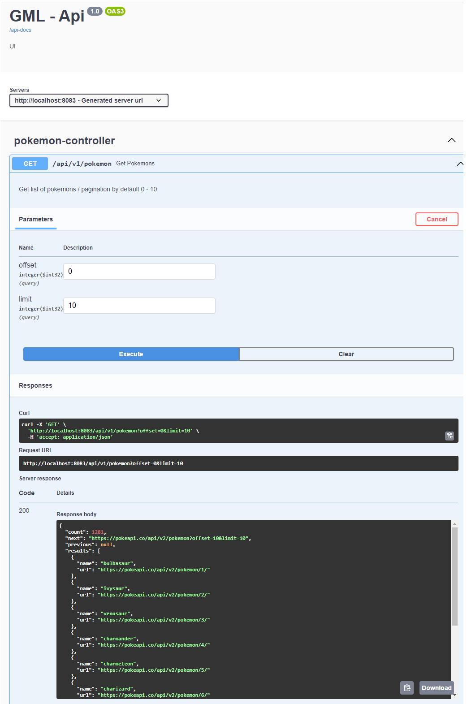
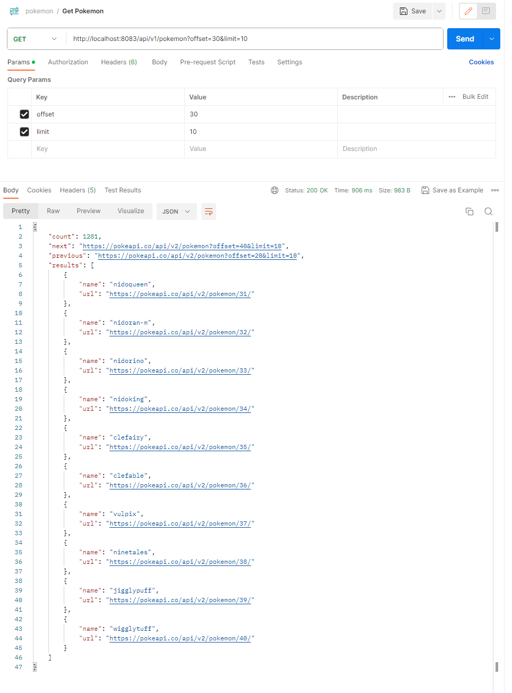
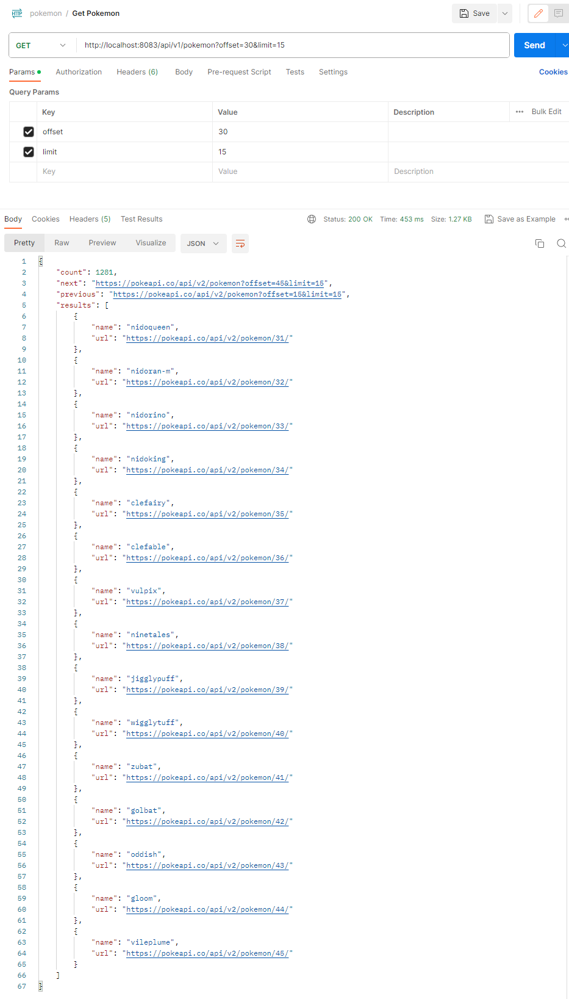
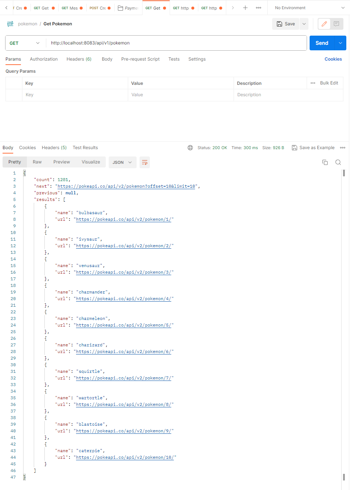

# Bank Challenge

## How to run it 

```bash
# Locally
$ ./gradlew bootRun

```
## URL http://localhost:8083/api/v1/pokemon

`pokemon.postman_collection.json` to import use case
examples.

### Swagger Integration

`http://localhost:8082/swagger-ui/index.html` to see



## Examples

### Example Pagination



### Example Pagination Other Scenario



### Example Pagination by default




### Design patterns Used

## Adapter

Used this pattern to avoid generating a coupling between the 
client, the service and controller layer, therefore a more structured cohesion 
with interfaces is realized.

## Builder

This pattern is used to simplify the creation of complex objects, 
through the ease of mapper we can transform our data in a structured and efficient way.

